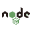

## Golang

## Javascript

## Dart

## Headless Browser

[***puppeteer***](https://pptr.dev/) Headless Chrome Node.js API https://pptr.dev/

## UI Framwork

## Font

[fontawesome] The iconic SVG, font, and CSS toolkit https://fontawesome.com

[iconfont] 阿里妈妈MUX倾力打造的矢量图标管理、交流平台 https://www.iconfont.cn/    

## Build Tool

[***webpack***] a static module bundler for modern JavaScript applications. https://webpack.js.org

## Http Client

 [***axios***](https://github.com/axios/axios) Promise based HTTP client for the browser and node.js

## Project Scaffolding Tool

[create-react-app](https://create-react-app.dev) Set up a modern web app by running one command.

## Website Tool

## Docs Tool

[storybook](https://storybook.js.org/) 📓 UI component dev & test: React, Vue, Angular, React Native, Ember, Web Components & more! https://storybook.js.org

[docusaurus](https://docusaurus.io) Easy to maintain open source documentation websites.